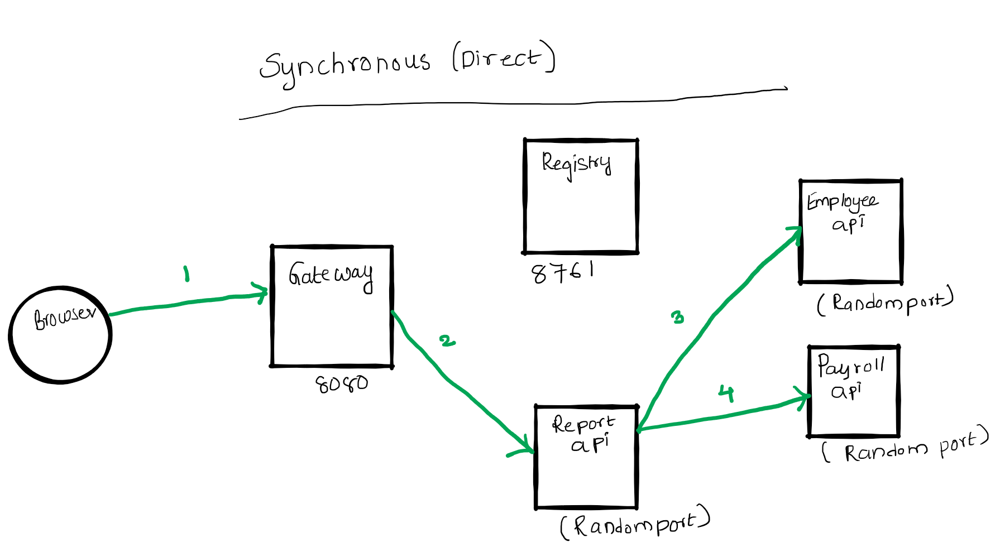

# Spring Cloud Session 3 Inter Microservice Communication Synchronous
In  this tutorial we are going to see how microservices communicate with each other. 
-There are two types of communication between microservice one is synchronous, and the other is asynchronous.
- In synchronous communication calling microservice **waits** till the called microservice responds.
- In asynchronous communication calling microservice will **not wait** till the called microservice responds.
- In this session we focus on Synchronous communication.
- There are two ways a microservice can communicate with other microservices
    - Direct: Microservice A speaks with  Microservice B Directly
    - Via Gateway: Instead of taking directly, Microservice A speaks with  Microservice B via gateway 
- This tutorial covers both the scenarios
- We will be developing report api which gives employee name,salary by communicating with employee-api,payroll-api
- For the purpose of this tutorial we developed two microservices
    - report-api-direct which calls employee-api,payroll-api directly
    - report-api-via-gateway calls employee-api,payroll-api via gateway
- **Note: In real world we favour to call microservices via a gateway even for inter communication. So I recommend using 
the  microservice report-api-via-gateway**  
Overview
- Run registry service on 8761. 
- Run employee-api service on dynamic port. Where it takes employee id and returns employee name.
- Run payroll-api service on dynamic port. Where it takes employee id and returns employee salary.
- Run report-api-direct service on dynamic port. Where it takes employee id and returns employee name and salary by 
directly communicating with employee-api and payroll-api.
- Run report-api-via-gateway service on dynamic port. Where it takes employee id and returns employee name and salary by 
directly communicating with employee-api and payroll-api indirectly via gateway.
- Run Gateway service on 8080 and reverse proxy requests to all the services (employee-api,payroll-api,report-api-direct,report-api-via-gateway)
- All the microservices (employee-api,payroll-api,report-api-direct,report-api-via-gateway,gateway) when they startup they register their service endpoint (rest api url)
 with registry
- Gateway Spring Cloud load balancer (Client side load balancing) component in Spring Cloud Gateway acts as reverse proxy.
It reads a registry for microservice endpoints and configures routes. 

Important Notes
- Netflix Eureka Server plays a role of Registry. Registry is a spring boot application with Eureka Server as dependency.
- Netflix Eureka Client is present in all the micro services (employee-api,payroll-api,report-api-direct,report-api-via-gateway,gateway) and they discover Eureka
server and register their availability with server.
- Generally Netflix Ribbon Component is used as Client Side load balancer, but it is deprecated project. We will be using
Spring Cloud Load balaner in gateway 
 

# Source Code 
``` git clone https://github.com/balajich/spring-cloud-session-3-inter-microservice-communication-sync.git``` 
# Video
[](https://www.youtube.com/watch?v=5WuallBaMnw)
- https://youtu.be/5WuallBaMnw
# Architecture

# Prerequisite
- JDK 1.8 or above
- Apache Maven 3.6.3 or above
# Clean and Build
- Java
    - ``` cd spring-cloud-session-3-inter-microservice-communication-sync ``` 
    - ``` mvn clean install ```
 
# Running components
- Registry: ``` java -jar .\registry\target\registry-0.0.1-SNAPSHOT.jar ```
- Employee API: ``` java -jar .\employee-api\target\employee-api-0.0.1-SNAPSHOT.jar ```
- Payroll API: ``` java -jar .\payroll-api\target\payroll-api-0.0.1-SNAPSHOT.jar ```
- Report API Direct: ``` java -jar .\report-api-direct\target\report-api-direct-0.0.1-SNAPSHOT.jar ```
- Report API via gateway: ``` java -jar .\report-api-via-gateway\target\report-api-via-gateway-0.0.1-SNAPSHOT.jar ```
- Gateway: ``` java -jar .\gateway\target\gateway-0.0.1-SNAPSHOT.jar ``` 

# Using curl to test environment
**Note I am running CURL on windows, if you have any issue. Please use postman client, its collection is available 
at spring-cloud-session-3-inter-microservice-communication-sync.postman_collection.json**
- Get employee report using report api ( direct): ``` curl -s -L  http://localhost:8080/report-api-direct/100 ```
- Get employee report using report-api-via-gateway: ``` curl -s -L  http://localhost:8080/report-api-via-gateway/100 ```
**Note:  **
# Code
*Registry(Service Registry)* is a Spring Boot application that uses Eureka Server. Snippet of **RegistryApplication**
```java
@SpringBootApplication
@EnableEurekaServer
public class RegistryApplication {

    public static void main(String[] args) {
        SpringApplication.run(RegistryApplication.class, args);
    }
}
```
*Employee API* is a simple spring boot based rest-api. Snippet of **EmployeeController**
```java
 // Initialize database
    private static final Map<Integer, Employee> dataBase = new HashMap<>();
    static {
        dataBase.put(100, new Employee(100,"Alex"));
        dataBase.put(101, new Employee(101,"Tom"));
    }


    @RequestMapping(value = "/employee/{employeeId}", method = RequestMethod.GET)
    public Employee getEmployeeDetails(@PathVariable int employeeId) {
        logger.info(String.format("Getting Details of Employee with id %s",employeeId ));
        return dataBase.get(employeeId);
    }
```
*Employee API* users Eureka Client , which discovers and registers with Server. Snippet of **EmployeeApiApplication**. It
binds to random port and registers with Eureka Server using name,dynamic id and random value.
```java
@SpringBootApplication
@EnableEurekaClient
public class EmployeeApiApplication {

    public static void main(String[] args) {
        SpringApplication.run(EmployeeApiApplication.class, args);
    }

}
```
Snippet of employee api **application.yml**
```yaml
server:
  port: ${PORT:0}
eureka:
  instance:
    instance-id: ${spring.application.name}:${spring.application.instance_id:${random.value}}
```
*Gateway* is a Spring boot application which uses Spring Cloud Load Balancer for Client Side Load balancing and Eureka Client to
discover healthy microservices. Snippet of **GatewayApplication**
```java
@SpringBootApplication
@EnableEurekaClient
public class GatewayApplication {

    public static void main(String[] args) {
        SpringApplication.run(GatewayApplication.class, args);
    }

}
```
It is mainly configuration driven  **application.yml**  
```yaml
cloud:
    loadbalancer:
      ribbon:
        enabled: false
    gateway:
      routes:
        - id: employee-api
          uri: lb://EMPLOYEE-API
          predicates:
            - Path=/employee/**
        - id: payroll-api
          uri: lb://PAYROLL-API
          predicates:
            - Path=/payroll/**
```

# Next Steps
- How micoservice communicate with each other,Inter microservice communication

# References
- https://spring.io/projects/spring-cloud
- https://en.wikipedia.org/wiki/Microservices
# Next Tutorial
https://github.com/balajich/spring-cloud-microservices-hello-world-dynamic-ports